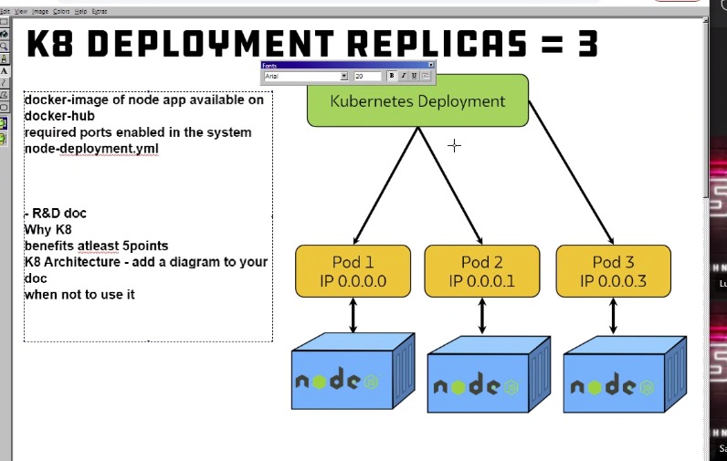

## Kubernetes (K8)



### Why use K8?
1. simplifies application management
2. improves scalability
3. enhances resource utilization

### What are the benefits of K8? 
1. It automates the deployment and scaling of applications, saving time and effort.
2. It ensures high availability and fault tolerance, keeping applications running smoothly.
3. It provides efficient resource utilization, optimizing the use of computing resources.
4. It enables easy management of containerized applications across different environments.
5. It supports seamless scaling and load balancing, allowing applications to handle increased traffic.

### When would you not use K8?
1. if you have very simple or small-scale applications that don't require complex orchestration
2. If you have limited resources or a small development team

## Containerisation vs Virtualisation
#### Containerization:
- Containers provide lightweight and isolated environments for running applications.
- They share the host operating system kernel, making them more efficient in terms of resource usage.
- Containers are faster to start, stop, and scale compared to virtual machines.
- They offer better application portability and consistency across different environments.

#### Virtualization:
- Virtual machines (VMs) emulate an entire computer system, including the operating system, on a physical host machine.
- Each VM runs its own operating system, which adds overhead in terms of resource consumption.
- VMs are isolated from each other, providing stronger security boundaries.
- They offer flexibility in running different operating systems and applications on the same physical hardware.

## Create K8 Deployment replicas 

### Step 1: Create yaml file

1. Create yaml file called *nginx_deployment.yml*
2. Copy and paste:

```commandline
apiVersion: apps/v1
kind: Deployment
metadata:
  name: nginx-deployment
spec:
  selector:
    matchLabels:
        app: nginx
  replicas: 3
  template:
    metadata:
      labels:
        app: nginx
      # define container spec
    spec:
      containers:
        - name: nginx
          image: wafamohbubul/nginx-254:latest
          ports:
            - containerPort: 80
```

### Step 2: Create and Run pods
3. `kubectl create -f nginx_deployment.yml`
4. `kubectl get pods`

### Step 3: To delete pods

`kubectl delete pod <filename>`

NOTE: The webpage *localhost* will not work

### Step 4: Create yml file to run services

1. Create another yaml file called *nginx_services.yml*
2. Copy and paste:
```commandline
apiVersion: v1
kind: Service
metadata:
  name: nginx-service
spec:
  selector:
    app: nginx
  ports:
    - protocol: TCP
      port: 80
      nodePort: 30010
  type: NodePort
```
### Step 5: Create and Run the file
`kubectl create -f nginx_services.yml `

### Step 6: Check it's working
In web browser, type **localhost:30010** and nginx should appear 

## Step 7: Deploying Sparta App

1. Create another yaml file called *sparta_app_deploy.yml*
2. Copy and paste:

```commandline
apiVersion: apps/v1
kind: Deployment
metadata:
  name: node-app-deployment
spec:
  replicas: 3
  selector:
    matchLabels:
      app: node-app
  template:
    metadata:
      labels:
        app: node-app
    spec:
      containers:
        - name: node-app
          image: wafamohbubul/sparta-app:latest
          ports:
            - containerPort: 3000
```

### Step 8: Create and Run the file
`kubectl create -f sparta_app_deploy.yml`

### Step 9: Create file for Sparta Node App

1. Create another yaml file called *sparta_mode_port.yml*
2. Copy and paste:
```
apiVersion: v1
kind: Service
metadata:
  name: node-app-service
spec:
  selector:
    app: node-app
  type: NodePort
  ports:
    - protocol: TCP
      port: 3000
      targetPort: 3000
      nodePort: 30100
```

### Step 10: Create file to create and run Sparta  App
`kubectl create -f sparta_mode_port.yml`