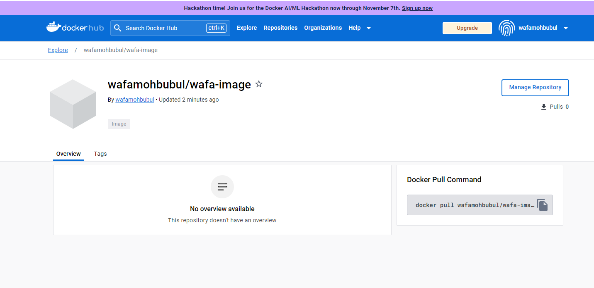

### Docker

1. Open GitBash Terminal 
`docker`

2. `docker --version` - what version of docker we're using 

3. `docker run -d -p 80:80 nginx` - create nginx image 

4. check its working --> type *localhost* in web browser. 
Should Display *Welcome to Nginx*

5. In GitBash, run ```docker ps```

6. `docker exec -it <ID of nginx Image> sh` 
NOTE: should be ID of nginx 

7. If error is displayed - `alias docker="winpty docker"`

8. Run `docker exec -it <ID of nginx Image> sh` again
NOTE: should be ID of nginx 

```
apt update -y
apt upgrade -y
apt install sudo
apt install nano
```

```
cd /usr
cd share
cd nginx
cd html
```

17. `pwd`

18. `ls`

19. `sudo nano index.html`
Edit index.html file with profile


### Building an Image and Pushing to Docker Hub

#### Step 1: Manual files in Local Machine 
1. Create directory *Dockerfile*
2. Inside *Dockerfile*, create file called *files*
3. Inside *Dockerfile*, create file called *dockerfile*
4. Inside *files*, create file called *default*
5. Inside *files*, create file called *index.html*

#### Step 2: Edit index.html file 
1. Copy and paste into index.html:
```commandline
<!DOCTYPE html>
<html>
<head>
<title>Welcome to nginx!</title>
<style>
html { color-scheme: light dark; }
body { width: 35em; margin: 0 auto;
font-family: Tahoma, Verdana, Arial, sans-serif; }
</style>
</head>
<body>
<h1>Welcome to nginx - Wafa Mohbubul!</h1>
<p>If you see this page, the nginx web server is successfully installed and
working. Further configuration is required. </p>
<p/> A tech-savvy individual, Wafa demonstrates a profound passion for DevOps , skilfully mergi
Her dedication to both disciplines sets her apart. Wafa's professional journey includes valuabl
software developer intern where she took it upon herself to self-teach Scala!
She is a fierce advocate for women in technology, having spearheaded her own campaign to empowe
Wafa's determination and resilience shine through, as she fearlessly launched her own wedding c
Her entrepreneurial spirit and ability to transform obstacles into opportunities make her a tru
Wafa embodies the ethos of seizing the moment and creating success against all odds.
Wafa embarked on exhilarating solo travels as a well-rounded person, exuding confidence and emb
Her passion for exploration and love for the outdoors make her an intrepid explorer,
seeking new heights and unforgettable experiences along the way. Wafa is also a thrill-seeker w

<p>For online documentation and support please refer to
<a href="http://nginx.org/">nginx.org</a>.<br/>
Commercial support is available at
<a href="http://nginx.com/">nginx.com</a>.</p>

<p><em>Thank you for using nginx.</em></p>
</body>
</html>
```

#### Step 3: Edit *dockerfile*
1. Copy and paste into *dockerfile* inside *file*:
```commandline
FROM ubuntu:18.04
LABEL maintainer="wafa.mohbubul@hotmail.com"
RUN  apt-get -y update && apt-get -y install nginx
COPY files/default /etc/nginx/sites-available/default
COPY files/index.html /usr/share/nginx/html/index.html
EXPOSE 80
CMD ["/usr/sbin/nginx", "-g", "daemon off;"]
```

#### Step 4: Edit *default* file 
1. Copy and paste into *default*:
```commandline
server {
    listen 80 default_server;
    listen [::]:80 default_server;

    root /usr/share/nginx/html;
    index index.html index.htm;

    server_name _;
    location / {
        try_files $uri $uri/ =404;
    }
}
```

#### Step 5: Build Image
1. Open GitBash Terminal 
2. Locate to **Dockerfile**
```
docker build -t wafa-image .
```
```commandline
docker run -d -p 81:80 wafa-image
```
```commandline
docker login
```

#### Step 7: Create a tag
```commandline
docker tag wafa-image wafamohbubul/wafa-image
```

#### Step 8: Push image to Docker
```commandline
docker push wafamohbubul/wafa-image
```


