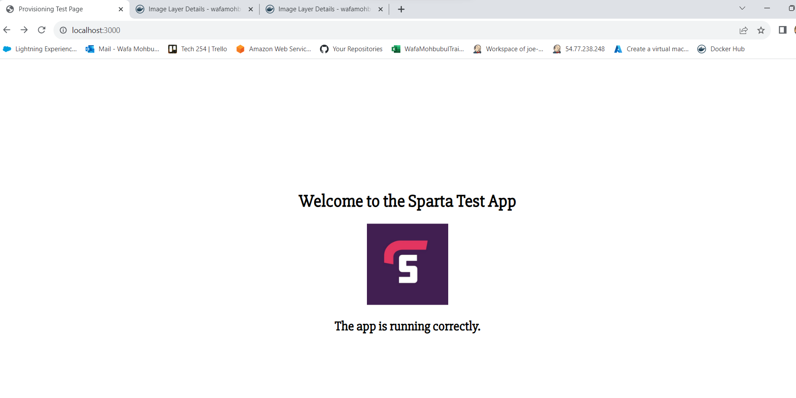
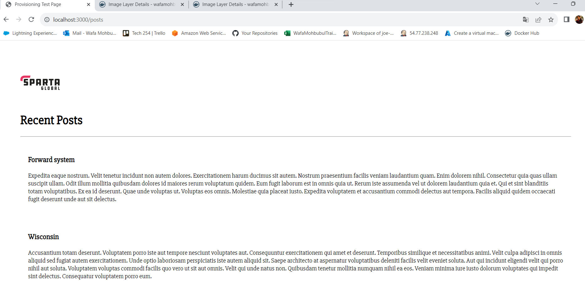

## Deploying App through Docker

Setting up Sparta Test App through Docker container 

### Step 1: Creating dockerfile 
1. Create a Directory with the app folder and a dockerfile
2. Go inside the app folder, where `app.js` exists
3. Create a `Dockerfile` by running `nano Dockerfile`
3. Inside the Docker file enter:

```
FROM node:latest
WORKDIR /app
COPY . .
RUN npm install
EXPOSE 3000
cmd [ "node", "app.js" ]

```
### Step 2: Build The Image

`docker build -t sparta-app .`

Check if image has been created using `docker images`

### Step 3: Build The Container

The image will run on port 3000

`docker run -d -p 3000:3000 sparta-app`

### Step 4: Check If It Is Working

Go onto your web browser and type in `localhost:3000`

### Step 5: Create Tag 

`docker tag sparta-app wafamohbubul/sparta-app`

### Step 6: Push To Dockerhub

`docker push wafamohbubul/sparta-app`

### Step 7: Creating Dockerfile for mongoDB 
1. Create another `Dockerfile` 
2. Inside the Docker file enter:
```commandline
# Use an official MongoDB image as a base
FROM mongo:4.4

# Copy a custom mongod.conf file that allows all connections
COPY mongod.conf /etc/mongod.conf

# Expose the default MongoDB port
EXPOSE 27017

# Specify the command to run MongoDB with the custom config file
CMD ["mongod", "--config", "/etc/mongod.conf"]
```

### Step 8: Create mongod.conf file
1. Create another file called `mongod.conf` 
2. Inside the Docker file enter:
```commandline
net:
  bindIp: 0.0.0.0
```

### Step 9: Build mongo-db Image

`docker build -t mongo-db .`

Check if image has been created using `docker images`

### Step 10: Run Image

`docker run -d -p 27017:27017 mongo-db`

### Step 11: Create Tag 

`docker tag mongo-db wafamohbubul/mongo-db`

### Step 12: Push To DockerHub

`docker push wafamohbubul/mongo-db`


### Step 13: Create Sparta Node Deployment File
1. Create yaml file called 'sparta_app_deploy.yml'
2. Copy and paste: 
```commandline
apiVersion: apps/v1
kind: Deployment
metadata:
  name: node-app-deployment
spec:
  replicas: 2  # Adjust the number of replicas based on your computer's capacity
  selector:
    matchLabels:
      app: node-app
  template:
    metadata:
      labels:
        app: node-app
    spec:
      containers:
        - name: node-app
          image: wafamohbubul/sparta-app:latest  # Replace with your Node.js app image
          ports:
            - containerPort: 3000  # Adjust if your app listens on a different port
          env:
            - name: DB_HOST
              value: mongodb://10.110.3.70:27017/posts
          lifecycle:
            postStart:
              exec:
                command: ["/bin/sh","-c", node seeds/seed.js]
```

### Step 14: Create Node services File
1. Create yaml file called 'sparta_node.yml'
2. Copy and paste: 
```commandline
apiVersion: v1
kind: Service
metadata:
  name: node-app-service  # Set the name of the Service
spec:
  selector:
    app: node-app  # Specify the label selector for matching pods
  ports:
    - protocol: TCP  # Specify the protocol for the ports (TCP in this case)
      port: 3000
      targetPort: 3000  # Port to expose on the Service
  type: LoadBalancer  # Specify the type of the Service (LoadBalancer in this case)
```

### Step 15: Create file for Mongo Deployment 
1. Create yaml file called 'mongo_deploy.yml'
2. Copy and paste:
```commandline
apiVersion: apps/v1 # which API to use for deployment
kind: Deployment # pod - service what kind of service/object

metadata:
  name: mongo-deployment # naming the deployment
spec:
  selector:
    matchLabels:
      app: mongo # look for this label to match with k8 service
    # lets create a replica set of this with instances/pods
  replicas: 3 #3 pods
    # template to use its label for k8 service to launch in the browser
  template:
    metadata:
      labels:
        app: mongo # This label connects to the service or any other K8 components
  # Lets define the container spec
    spec:
      containers:
      - name: mongo
        image: wafamohbubul/mongo-db:latest # use the image that you built in your dockerhub
        ports:
        - containerPort: 27017
```

### Step 16: Create file for mongo services
1. Create yaml file called 'mongo_deploy.yml'
2. Copy and paste:
```commandline
apiVersion: v1
kind: Service
metadata:
  name: mongo-service
spec:
  selector:
    app: mongo
  ports:
    - protocol: TCP
      port: 27017
      targetPort: 27017
  type: ClusterIP
```
### Run Commands

`kubectl create -f sparta_app_deploy.yml`

`kubectl create -f sparta_node.yml`

`kubectl create -f mongo_services.yml `

`kubectl create -f mongo_deploy.yml `

### To UPDATE instead of Create
If the file has already been created but changed, run:

`kubectl apply -f sparta_app_deploy.yml`

`kubectl apply -f sparta_node.yml`

`kubectl apply -f mongo_services.yml `

`kubectl apply -f mongo_deploy.yml `

### Check its working 

1. Open Web Browser

2. Type `localhost:3000` - expect welcome to Sparta App



3. Type `localhost:3000/posts` - expect Recent Posts page in Sparta app

